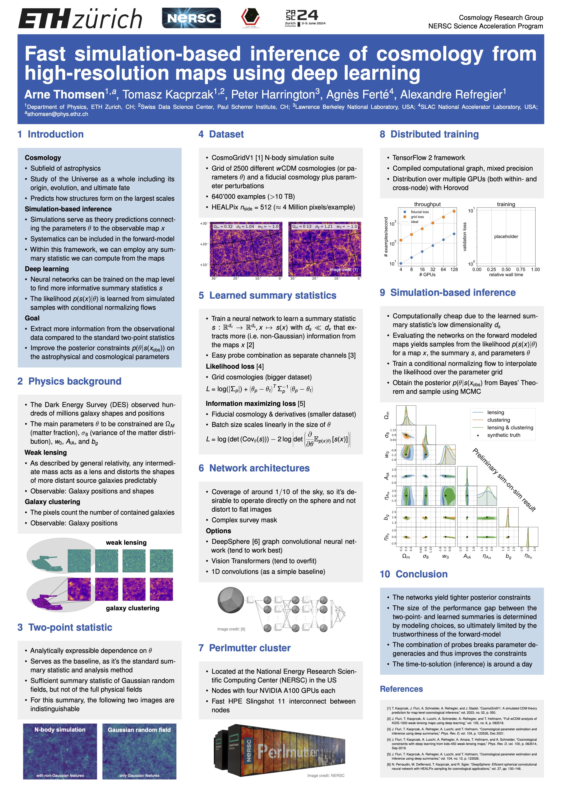

# y3-deep-lss

This repository contains the pipeline to train neural networks that learn informative summary statistics from the Dark Energy Survey Year 3 (DES Y3)-like weak lensing and galaxy clustering maps [[Thomsen et al. 2025](https://arxiv.org/abs/2511.04681)].

- **Training Data:** [HEALPix](https://healpix.sourceforge.io/) maps in spherical (curved) geometry masked according to the DES Y3 survey footprint and stored as tensors in `.tfrecord` format as generated by [`multiprobe-simulation-forward-model`](https://github.com/des-science/multiprobe-simulation-forward-model)..
- **Architectures:** Per default, we use the DeepSphere graph convolutional neural networks [[Defferrard et al. 2020](https://arxiv.org/abs/2012.15000)] from [`deepsphere-cosmo-tf2`](https://github.com/deepsphere/deepsphere-cosmo-tf2). Alternative choices include 1D convolutional networks and vision transformers.
- **Loss Functions:** The preferred loss function to train networks to implement a mapping from pixel space to low-dimensional, yet informative summary statistics is variational mutual information maximization. Alternative choices include the mean squared error, log-likelihood loss, and Fisher information maximization. 
- **HPC Distribution:** Multi-GPU support (intra- and cross-node) for data parallel training on HPC clusters. Optimized for the [Perlmutter A100 cluster](https://docs.nersc.gov/systems/perlmutter/architecture/) at the [National Energy Research Scientific Computing (NERSC)](https://www.nersc.gov/) facility.

## Installation

#### Requirements

## Repository Structure

### `deep_lss`
- `deep_lss/apps` training and evaluation scripts to be submitted via `slurm`. 
- `deep_lss/models` loss function-specific model classes. 
- `deep_lss/nets` neural network implementations.
- `deep_lss/utils` loss function implementations, multi-GPU distribution and miscellaneous utilities.

### `configs`
Configuration files specifying the network, loss, and optimizer hyperparameters, and analysis choices like the cosmological probe(s) to include, parameters to be constrained, and smoothing scales.

### `notebooks`
Development and debugging notebooks.

### `submissions`
Submission bash scripts for correct HPC `slurm` scheduling of the training jobs.

## [Platform for Advanced Scientific Computing (PASC) 2024](https://pasc24.pasc-conference.org/presentation/?id=pos117&sess=sess158)
