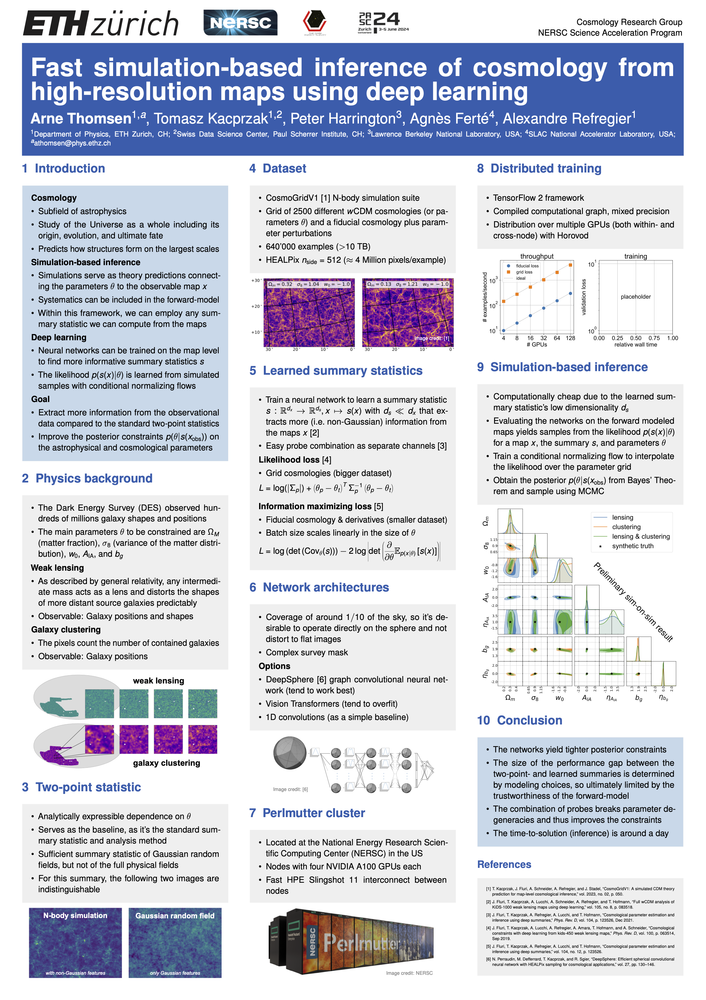

# y3-deep-lss
[](https://arxiv.org/abs/2511.04681)
[](LICENSE)

Training pipeline for neural networks that learn informative summary statistics from Dark Energy Survey Year 3 (DES Y3)-like weak lensing and galaxy clustering maps [[Thomsen et al. 2026](https://arxiv.org/abs/2511.04681)].

- **Training data:** [HEALPix](https://healpix.sourceforge.io/) maps in spherical (curved) geometry, masked to the DES Y3 survey footprint and stored as tensors in `.tfrecord` format by [`multiprobe-simulation-forward-model`](https://github.com/des-science/multiprobe-simulation-forward-model).
- **Architectures:** By default the DeepSphere graph convolutional networks [[Defferrard et al. 2020](https://arxiv.org/abs/2012.15000)] from [`deepsphere-cosmo-tf2`](https://github.com/deepsphere/deepsphere-cosmo-tf2), in single- and multi-resolution variants. A HEALPix/nested-patch transformer encoder is the alternative; 1D convolutional networks and vision transformers are retained under `nets/encoders/maps/legacy/` for reference.
- **Loss functions:** The preferred objective is variational mutual information maximization, which trains the network to map pixel space to a low-dimensional yet informative summary. Mean squared error, an explicit log-likelihood loss and a Fisher-information (`delta`) loss are also implemented.
- **Two analysis branches:** the **maps** branch trains directly on the pixelized sphere; the **Cls** branch trains on binned angular power spectra, and the composite networks in `nets/composite/` combine the two into a single summary.
- **HPC distribution:** Data-parallel multi-GPU training, both intra- and cross-node, via `tf.distribute` or [Horovod](https://horovod.ai/), selected with `--dist_strategy`.

## The analysis pipeline

This repository is the second of three stages:

```
CosmoGridV1 simulations
        |
        v
multiprobe-simulation-forward-model    DES Y3-like WL + GC maps in .tfrecord
        |
        v
y3-deep-lss                            low-dimensional neural summary statistics    <-- this repository
        |
        v
multiprobe-simulation-inference        cosmological posterior constraints
```

[`deepsphere-cosmo-tf2`](https://github.com/deepsphere/deepsphere-cosmo-tf2) supplies the graph convolutional layers on the HEALPix sphere that this repository builds on.
For a full environment, install in dependency order: `deepsphere-cosmo-tf2` → `multiprobe-simulation-forward-model` → `y3-deep-lss` → `multiprobe-simulation-inference`.

## Installation

Requires Python >= 3.8, TensorFlow >= 2.0, TensorFlow-Probability, and — for the Horovod strategy — Horovod.

**Dependencies.** The two companion packages are *not* declared in [`pyproject.toml`](pyproject.toml)
(they are not on PyPI) and must be installed first:

| Package | Why it is needed | Install |
|---|---|---|
| [`multiprobe-simulation-forward-model`](https://github.com/des-science/multiprobe-simulation-forward-model) | Data loading, survey configuration, scale cuts | `pip install git+https://github.com/des-science/multiprobe-simulation-forward-model.git` |
| [`deepsphere-cosmo-tf2`](https://github.com/deepsphere/deepsphere-cosmo-tf2) | Graph convolutions on the pixelized sphere | `pip install git+https://github.com/deepsphere/deepsphere-cosmo-tf2.git` |
| [`multiprobe-simulation-inference`](https://github.com/des-science/multiprobe-simulation-inference) | Only for the inference stage, and for the Cls dataset utilities | `pip install git+https://github.com/des-science/multiprobe-simulation-inference.git` |

**Install.**

*On clusters where TensorFlow and Horovod are already provided* (recommended — preserves the optimized GPU/MPI build):

```bash
pip install -e .
```

*Elsewhere:*

```bash
pip install -e .[tf]
```

**Extras** declared in [`pyproject.toml`](pyproject.toml):

| Extra | Adds |
|---|---|
| `tf` | `tensorflow>=2.0`, `tensorflow-probability`, `horovod[tensorflow]` |
| `dev` | `pytest`, `pytest-cov`, `black`, `flake8`, `ipython`, `jupyter`, `matplotlib` |

## Quickstart

Train a lensing network on the cosmology grid, then evaluate it. Substitute your own paths for
`DATA` (the `multiprobe-simulation-forward-model` output) and `RUNS` (where checkpoints go).

```bash
DATA=/path/to/forward_model_output
RUNS=/path/to/runs
MSFM=/path/to/multiprobe-simulation-forward-model

# 1. train
python deep_lss/apps/run_training.py \
    --dir_base="$RUNS/lensing" \
    --dir_model=maps \
    --train_tfr_pattern="$DATA/tfrecords/grid/DESy3_grid_dmb_????.tfrecord" \
    --data_dir="$DATA" \
    --msfm_config="$MSFM/configs/v18/default.yaml" \
    --probes_config=configs/probes/lensing.yaml \
    --scales_config=configs/scales/8wl,32gc.yaml \
    --loss_config=configs/loss/vmim.yaml \
    --data_config=configs/data/default.yaml \
    --net_config=configs/maps/prod/deepsphere/lensing/maps.yaml \
    --dist_strategy=mirrored

# 2. evaluate over the cosmology grid and the observations
python deep_lss/apps/run_evaluation.py \
    --dist_strategy=mirrored \
    --grid_vali_tfr_pattern="$DATA/tfrecords/grid/DESy3_grid_dmb_????.tfrecord" \
    --data_dir="$DATA" \
    --include_grid --include_des --include_mocks
```

Step 3 — turning the resulting summaries into a posterior — lives in
[`multiprobe-simulation-inference`](https://github.com/des-science/multiprobe-simulation-inference).
Drop `--dist_strategy` to run on a single device.

## Usage

### The configuration contract

An analysis is defined by *six* config files, composed on the command line. This is the central
convention of the repository: each file owns exactly one axis, so a run is fully specified by the
tuple, and any two runs differ in a readable way.

| Flag | Comes from | Selects |
|---|---|---|
| `--msfm_config` | the `msfm` repository | which forward-model dataset, and the survey definition it was built with |
| `--probes_config` | [`configs/probes/`](configs/probes/) | probe combination (lensing / clustering / cross / combined / 3x2pt) and the parameters to constrain |
| `--scales_config` | [`configs/scales/`](configs/scales/) | smoothing scales and scale cuts |
| `--loss_config` | [`configs/loss/`](configs/loss/) | training objective |
| `--data_config` | [`configs/data/`](configs/data/) | train/test split of the simulation realizations |
| `--net_config` | [`configs/<arch>/<probe>/`](configs/) | network architecture, batch size and step budget |

**The merged result is written into the run directory as `configs.yaml`**, and
`msi/apps/run_inference.py` reads it back from there. That file — not the repository YAML — is the
record of what a run actually did.

### Entry points

All under [`deep_lss/apps/`](deep_lss/apps/), in three groups: the production scripts at the top
level, [`apps/benchmark/`](deep_lss/apps/benchmark/) for sizing a network before training it, and
[`apps/tuning/`](deep_lss/apps/tuning/) for scoring runs after.

**Production** — the release path. Each needs the TensorFlow environment and a GPU.

| App | What it does |
|---|---|
| `run_training.py` | The main entry point. Trains a network on the cosmology grid with the selected objective; handles the distribution strategy, checkpointing and restore, mixed precision, XLA, and logging to Weights & Biases or TensorBoard. `--n_steps` sets a step budget; `--wall_budget_seconds` instead trains for a fixed wall-clock time and anneals the learning-rate schedule to land exactly on it. |
| `run_evaluation.py` | Runs a trained network over the cosmology grid (`--include_grid`), the DES Y3 catalogs (`--include_des`) and every mock observation in `data_dir/obs/`, CosmoGrid benchmarks and the Buzzard flock alike (`--include_mocks`), writing the predicted summaries. |
| `run_cls_training+evaluation.py` | The Cls branch: trains and evaluates in one script on binned angular power spectra rather than maps, with `asinh` scaling and PCA whitening as input preprocessing. `--precache_only` builds just the rebinned-Cls cache, which the maps+Cls networks require. |

**`benchmark/`** — what fits and how fast it steps, before a run is launched. Driven by
[`submissions/clariden/shared/benchmark_sweep.sh`](submissions/clariden/shared/benchmark_sweep.sh),
which takes any of these by name.

| App | What it does |
|---|---|
| `benchmark_resnet.py`, `benchmark_transformer.py` | Sweep architecture configs × batch sizes for GPU memory fit and step time, building through the exact `run_training.py` code path but on synthetic batches. |
| `benchmark_dataloader.py`, `benchmark_dataloader_summary.py` | Benchmark the `tf.data` input pipeline in isolation (CPU only) and tabulate the resulting JSONL. |

**`tuning/`** — how good a finished run is: the two modules that decide which architecture to keep.
Unlike everything above they *read* runs rather than producing them, and depend only on
numpy/h5py/yaml (plus scipy for `run_diagnostics coverage`), so they need neither TensorFlow nor a
GPU and are run on a login node as `python -m deep_lss.apps.tuning.<module>`.

| App | What it does |
|---|---|
| `run_comparison.py` | Ranks trained runs by **paired** figure of merit on the shared coverage mocks, pairing on the full `real_idx` tuple and bootstrapping the CI over mocks. Gates the comparison on the config fields that must agree for it to mean anything, and marks any ratio inside the measured seed scatter as a wash. `--cross_modality` is the neural-summary-vs-two-point comparison. |
| `run_diagnostics.py` | The three questions the FoM cannot answer, one subcommand each: `robustness` (posterior shift on the systematics-variation mocks), `coverage` (SBC rank and HPD calibration of the density estimator) and `des-fom` (the DES-vs-simulation divergence, unsigned). Reuses `run_comparison`'s helpers so every table names runs and picks checkpoints identically. |

### Architectures

[`deep_lss/nets/`](deep_lss/nets/) is a subpackage tree, not one file per architecture:

| Path | Contains |
|---|---|
| `encoders/maps/gcnn/` | DeepSphere graph convolutional encoders — `resnet.py` and the multi-resolution `resnet_multires.py`. The default. |
| `encoders/maps/transformer/` | HEALPix and nested-patch transformer encoders |
| `encoders/maps/legacy/` | 1D convolutions and a vision transformer; kept for reference, not used for new work |
| `encoders/cls/` | MLP, CNN and transformer encoders for the Cls branch |
| `composite/` | maps + Cls combinations, one per maps encoder family |
| `layers/maps/`, `layers/cls/` | smoothing, input normalization, global attention; binning, embedding, whitening |
| `estimators/`, `heads/` | the density estimators the mutual-information loss maximizes against (normalizing flow, Gaussian mixture), and the regression head |

## Repository layout

```
deep_lss/
  apps/            the entry points above: the production scripts, plus benchmark/ (pre-training
                   sizing) and tuning/ (post-training scoring, login-node only)
  models/          one model class per loss function, combining data loading, network and loss
                     base_model.py, delta_model.py, grid_model.py
  nets/            the architecture tree above
  utils/           losses (mutual_info_loss, delta_loss, likelihood_loss), optimization,
                   multi-GPU distribution (distribute/), evaluation, throughput, Cls
                   preprocessing, configuration, config_check (the benchmark-config validator,
                   with a `python -m` command line of its own)
configs/           analysis choices (data/ probes/ scales/ loss/) and architectures
                   (deepsphere/ transformer/ cls/, each split by probe)
submissions/       SLURM scripts, parameterized by environment variable rather than copied
                   per experiment; split into maps/, cls/ and shared/
notebooks/         training and evaluation walk-throughs, FoM diagnostics
dev/               exploratory notebooks, scripts and notes; not part of the release path
```

### `configs`

Two kinds of directory:

- **Analysis choices**, flat: [`data/`](configs/data/), [`probes/`](configs/probes/),
  [`scales/`](configs/scales/), [`loss/`](configs/loss/).
- **Architectures**, shaped `<arch>/<probe>/`: `deepsphere/`, `transformer/` and `cls/`, each with
  a subdirectory per probe holding `maps.yaml` and `maps+cls.yaml` (the defaults). Benchmark
  rounds live alongside them in `bench_*/` subdirectories, each carrying its own `README.md`
  describing what that round varied and what it concluded.

### `submissions`

SLURM scripts for a multi-GPU cluster, kept parameterized rather than duplicated: `maps/training.sh`
runs train → evaluate → infer in one job, `maps/training_chainer.sh` chains several of them for
budgets longer than one allocation, `maps/rerun/` re-runs individual stages, `cls/` is the Cls
equivalent, and `shared/` holds the domain-agnostic benchmark driver. They are written against one
specific cluster and are included as a worked example of how the stages fit together, not as a
portable script set.

## Conventions

- **A restored run reads the `configs.yaml` in its own run directory.** Editing the repository
  YAML part-way through a chained run therefore does nothing. Override on the command line
  (`--n_steps`, `--wall_budget_seconds`) instead.
- **The probes config must match the dataset's intrinsic-alignment model, and a mismatch does not
  raise.** Datasets built with extended NLA (a `bta` parameter in the forward model) take the
  plain `configs/probes/*.yaml`; standard-NLA datasets take the `*_nla.yaml` ones. Using an
  `_nla` config on extended-NLA data silently marginalizes over a parameter instead of failing.
  The header of [`configs/probes/lensing_nla.yaml`](configs/probes/lensing_nla.yaml) spells this out.
- **maps+Cls networks require a precomputed rebinned-Cls cache.** `run_training.py` only *reads*
  it and aborts if it is missing; build it first with
  `run_cls_training+evaluation.py --precache_only`. The cache spans all probe pairs, so it is
  built with the `combined` probes config regardless of which probe you are training.
- **One knob per benchmark arm.** Config variants under `bench_*/` change a single hyperparameter
  from their round's baseline, so that a difference in the resulting figure of merit is
  attributable.
- **Write scientific-notation floats with an explicit decimal point.** In YAML, a bare `1e-3`
  parses as a *string*; `1.0e-3` parses as a float. The string silently propagates.

## Troubleshooting

| Symptom | Cause and fix |
|---|---|
| Training aborts complaining about a missing rebinned-Cls file | The maps+Cls cache has not been built. Run `run_cls_training+evaluation.py --precache_only` with the `combined` probes config and the same scales config. |
| A config edit has no effect on a restored run | The run reads its own `configs.yaml`. Pass the override as a command-line flag, or start a fresh run directory. |
| A parameter is marginalized that should have been fixed (or vice versa) | The probes config does not match the dataset's intrinsic-alignment model. See the note above. |
| Multi-GPU training hangs at the first collective operation | Memory-marginal configurations can deadlock in the all-reduce rather than raising out-of-memory. Reduce the batch size or the model size and re-run the benchmark scripts to find a configuration with headroom. |
| A hyperparameter behaves as if unset, with no error | A bare `1e-3` in the config YAML parsed as a string. Write `1.0e-3`. |

## Companion repositories

| Repository | Package | Role |
|---|---|---|
| [`multiprobe-simulation-forward-model`](https://github.com/des-science/multiprobe-simulation-forward-model) | `msfm` | Forward-models DES Y3-like weak lensing and galaxy clustering maps from CosmoGridV1 |
| **`y3-deep-lss`** (this repository) | `deep_lss` | Trains networks that compress those maps into informative summary statistics |
| [`multiprobe-simulation-inference`](https://github.com/des-science/multiprobe-simulation-inference) | `msi` | Turns summary statistics into cosmological posterior constraints |
| [`deepsphere-cosmo-tf2`](https://github.com/deepsphere/deepsphere-cosmo-tf2) | `deepsphere` | Graph convolutional layers on the HEALPix sphere, used by `y3-deep-lss` |

## License and citation

Released under the terms of the [MIT license](LICENSE).

If you use this code, please cite:

```bibtex
@misc{thomsen2026darkenergysurveyyear,
      title={Dark Energy Survey Year 3 results: Simulation-based $w$CDM inference from weak lensing and galaxy clustering maps with deep learning: Analysis design},
      author={A. Thomsen and J. Bucko and T. Kacprzak and V. Ajani and J. Fluri and A. Refregier and D. Anbajagane and F. J. Castander and A. Ferté and M. Gatti and N. Jeffrey and A. Alarcon and A. Amon and K. Bechtol and M. R. Becker and G. M. Bernstein and A. Campos and A. Carnero Rosell and C. Chang and R. Chen and A. Choi and M. Crocce and C. Davis and J. DeRose and S. Dodelson and C. Doux and K. Eckert and J. Elvin-Poole and S. Everett and P. Fosalba and D. Gruen and I. Harrison and K. Herner and E. M. Huff and M. Jarvis and N. Kuropatkin and P. -F. Leget and N. MacCrann and J. McCullough and J. Myles and A. Navarro-Alsina and S. Pandey and A. Porredon and J. Prat and M. Raveri and M. Rodriguez-Monroy and R. P. Rollins and A. Roodman and E. S. Rykoff and C. Sánchez and L. F. Secco and E. Sheldon and T. Shin and M. A. Troxel and I. Tutusaus and T. N. Varga and N. Weaverdyck and R. H. Wechsler and B. Yanny and B. Yin and Y. Zhang and J. Zuntz and M. Aguena and S. Allam and F. Andrade-Oliveira and D. Bacon and J. Blazek and D. Brooks and R. Camilleri and J. Carretero and R. Cawthon and L. N. da Costa and M. E. da Silva Pereira and T. M. Davis and J. De Vicente and S. Desai and P. Doel and J. García-Bellido and G. Gutierrez and S. R. Hinton and D. L. Hollowood and K. Honscheid and D. J. James and K. Kuehn and O. Lahav and S. Lee and J. L. Marshall and J. Mena-Fernández and F. Menanteau and R. Miquel and J. Muir and R. L. C. Ogando and A. A. Plazas Malagón and E. Sanchez and D. Sanchez Cid and I. Sevilla-Noarbe and M. Smith and E. Suchyta and M. E. C. Swanson and D. Thomas and C. To and D. L. Tucker},
      year={2026},
      eprint={2511.04681},
      archivePrefix={arXiv},
      primaryClass={astro-ph.CO},
      doi={https://doi.org/10.1103/3sj1-1l9f},
      url={https://arxiv.org/abs/2511.04681},
}
```

Please also cite [DeepSphere](https://arxiv.org/abs/2012.15000) (Defferrard et al. 2020), whose graph convolutional layers the default architectures are built on.

## [Platform for Advanced Scientific Computing (PASC) 2024](https://pasc24.pasc-conference.org/presentation/?id=pos117&sess=sess158)
<a href="dev/figures/pasc_poster.png"></a>
